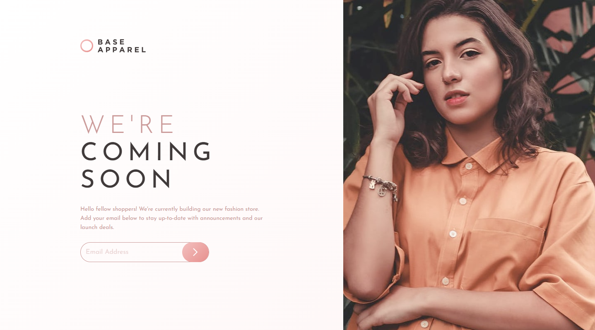

## 🚀 Overview

The challenge was to build out a responsive coming soon page that closely matches the given design. The project provided an excellent opportunity to practice **CSS Grid**, **Flexbox**, and **JavaScript form validation**.

### ✅ Users Should Be Able To:
- View the optimal layout for the interface depending on their device's screen size.
- See hover and focus states for all interactive elements on the page.
- Receive an error message when the form is submitted if:
  - The input field is empty.
  - The email address is not formatted correctly.

---

## 💻 Technologies Used

- **HTML5** for structuring content.
- **CSS3** with custom properties (variables), Grid, and Flexbox for layout and design.
- **JavaScript** for handling form validation and interactivity.

---

## 📄 Features

- **Responsive Design**: Optimized for both desktop and mobile devices using CSS Grid and media queries.
- **Form Validation**: Real-time validation to check for empty inputs and incorrect email formats.
- **Interactive States**: Hover and focus states implemented for interactive elements like buttons.
- **Error Handling**: Visual feedback for invalid inputs with red borders and error messages.

---

## 📝 How Validation Works

- **Empty Field**: Displays an error message "Email is required".
- **Invalid Format**: Displays an error message "Please provide a valid email address.".
- **Valid Input**: Displays a green border around the input field.

---

## 📚 Learnings

- Focused primarily on the **JavaScript portion**, especially handling form validation and dynamic error messages.
- Faced challenges with **CSS layout**, particularly with the **layout structure order change** between the logo and hero image.
- Did not expect it to be challenging to **extend the hero image** to reach the very **top and bottom of the screen** while maintaining responsiveness and alignment.
- Encountered difficulties ensuring the **overall responsiveness** of the website due to the complex layout structure.
- Practiced **responsive design** using CSS Grid and Flexbox.
- Utilized **CSS custom properties** for cleaner and more manageable styling.

---

## 🌐 Live Site

[\[Add your live site link here once deployed\]](https://jayco01.github.io/base-apparel-coming-soon-page/)

